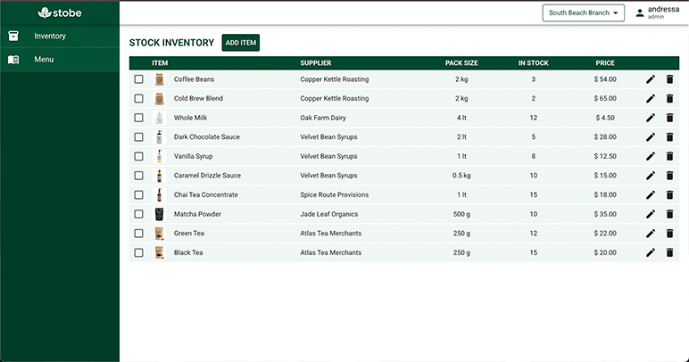

## ☕ Stobe

<a href="https://projects.andressabertolini.com/stobe/" target="_blank">
  
</a>

**Stobe** is inventory management system for a multi-branch coffee shop. It helps to keep track of the inventory and sinalizes when to make orders for more supplies by registering the coffee shop sales.

<a href="https://projects.andressabertolini.com/stobe/" target="_blank">
  
</a>

<br>

## 🚀 Technologies

- React + Vite
- Typescript
- Redux
- CSS Modules
- Material UI
- Sass

**Assets:**
- APIs: Backend APIs are mocked using [MSW](https://mswjs.io/) for demonstration purposes 

<br>

## ✨ Features

- Login
- Store selection

<br>

## 🛠️ Installation

1. Clone the repository:

```bash
git clone https://github.com/andressabertolini/stobe.git
cd stobe
```

2. Install dependencies:
```
npm install
```

3. Start the development server:
```
npm run dev
```

The app will run at http://localhost:5173
